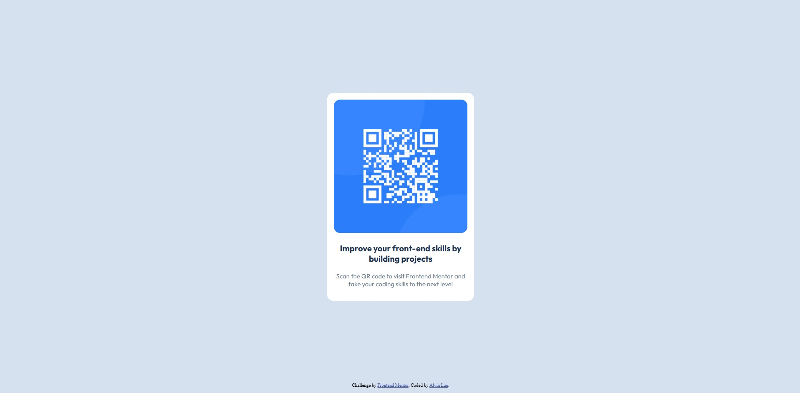

# Frontend Mentor - QR code component solution

This is a solution to the [QR code component challenge on Frontend Mentor](https://www.frontendmentor.io/challenges/qr-code-component-iux_sIO_H). Frontend Mentor challenges help you improve your coding skills by building realistic projects. 

## Table of contents

- [Overview](#overview)
  - [Screenshot](#screenshot)
  - [Links](#links)
- [My process](#my-process)
  - [Built with](#built-with)
  - [What I learned](#what-i-learned)
- [Author](#author)
- [Acknowledgments](#acknowledgments)


## Overview

### Screenshot
### Desktop

### Mobile


### Links

- Solution URL: [Add solution URL here](https://github.com/AlvinTheDeveloper/frontend-practice-qr-code-component.git)
- Live Site URL: [Add live site URL here](https://alvinthedeveloper.github.io/frontend-practice-qr-code-component/)

## My process

### Built with
- HTML5
- CSS
- Flexbox


### What I learned

This project helped me strengthen my understanding of several key frontend development concepts:


**CSS Layout and Styling**
- Gained experience with CSS Flexbox for centering content both horizontally and vertically
- Learned to use CSS custom properties (variables) for consistent color management
- Practiced responsive design principles with mobile-first approach
- Understood how to create clean, modern card designs with proper spacing and shadows

**Responsive Design**
- Implemented a mobile-first responsive design that works seamlessly across different screen sizes
- Learned to use relative units (rem) for better scalability
- Gained experience with media queries for desktop optimization

**Design Implementation**
- Practiced converting design mockups into functional HTML/CSS code
- Learned to pay attention to design details like border radius, and typography
- Understood the importance of maintaining visual hierarchy and spacing

Here's a code snippet showing the centered container:

```css
body {
  background-color: #D5E1EF;
  display: flex;
  justify-content: center;
  align-items: center;
  min-height: 100vh;
  margin: 0;
}

.container {
  width: 100%;
  max-width: 320px;
  background-color: #fff;
  padding: 1rem;
  border-radius: 15px;
  margin: 0 auto;
  text-align: center;
}
```

## Author
- [Frontend Mentor](https://www.frontendmentor.io/profile/AlvinTheDeveloper)
- [Linkedin](https://www.linkedin.com/in/lau-yat-hay-alvin)

